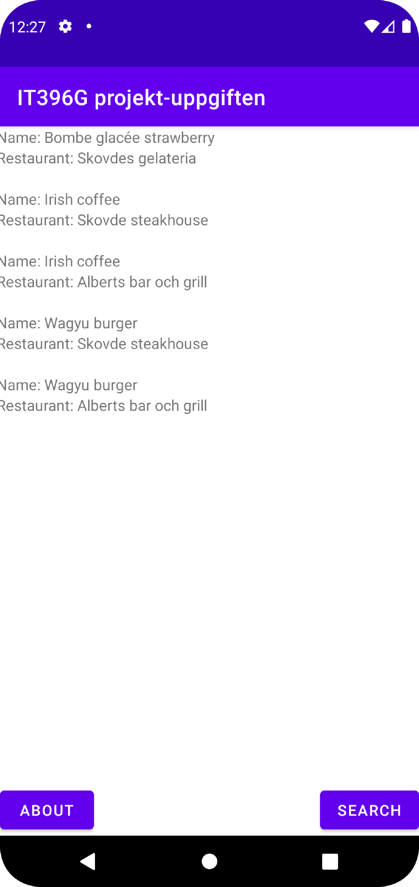
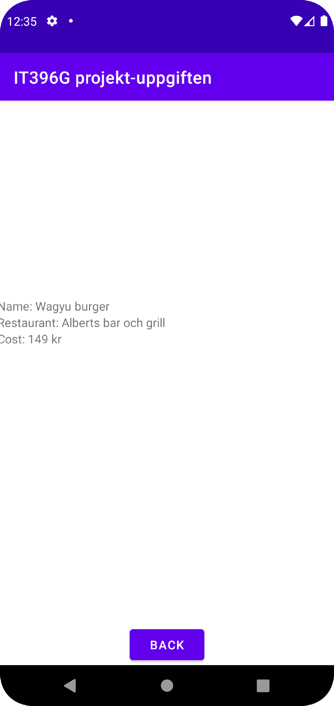
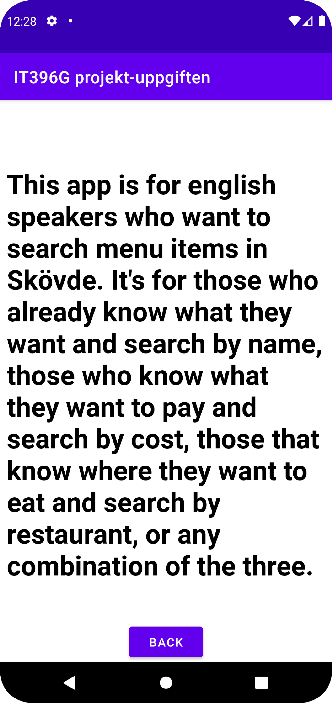
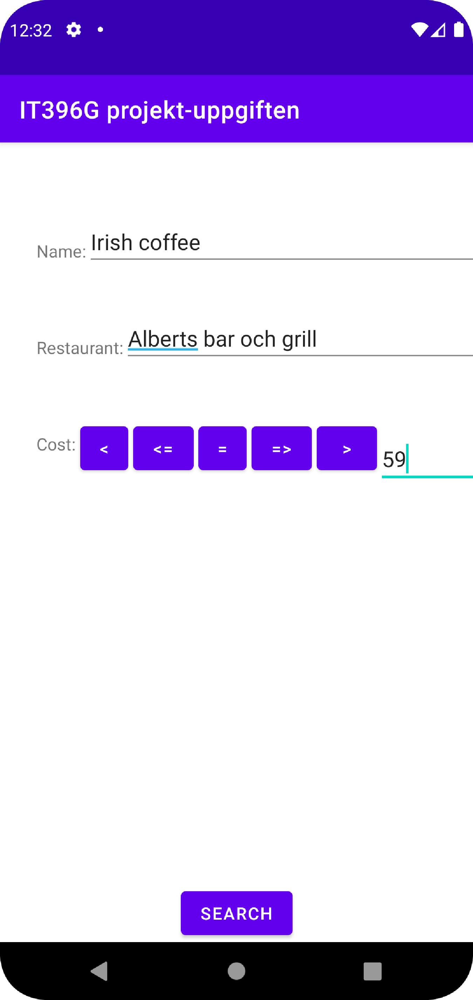
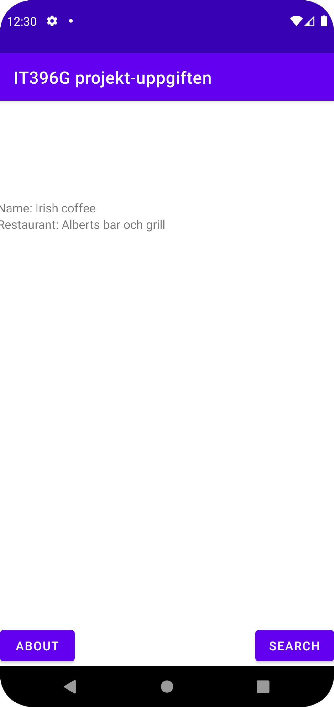
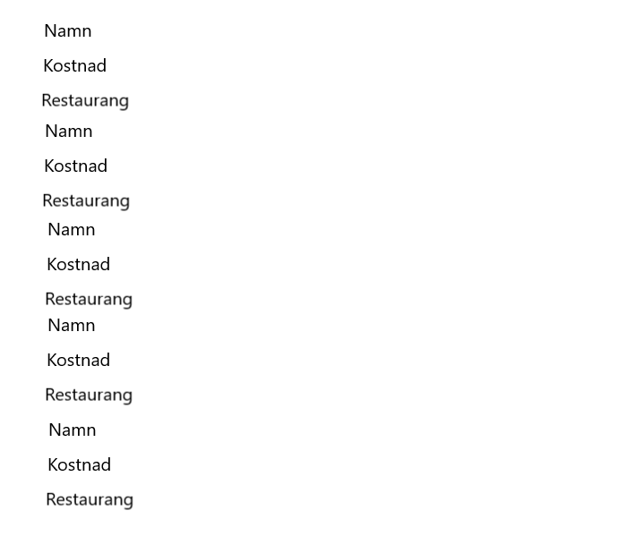
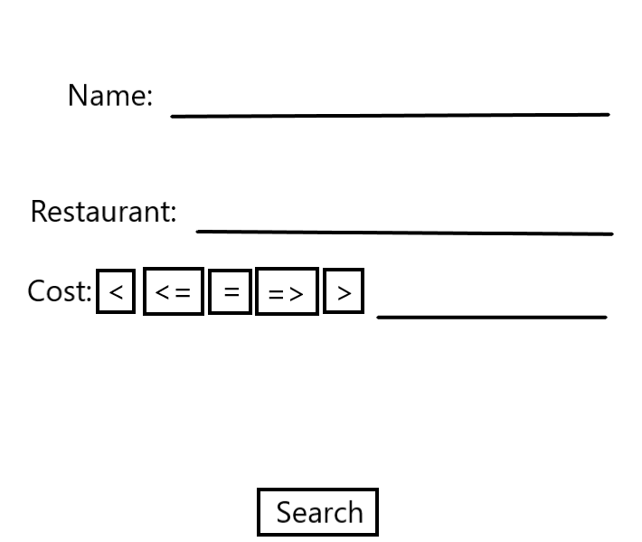
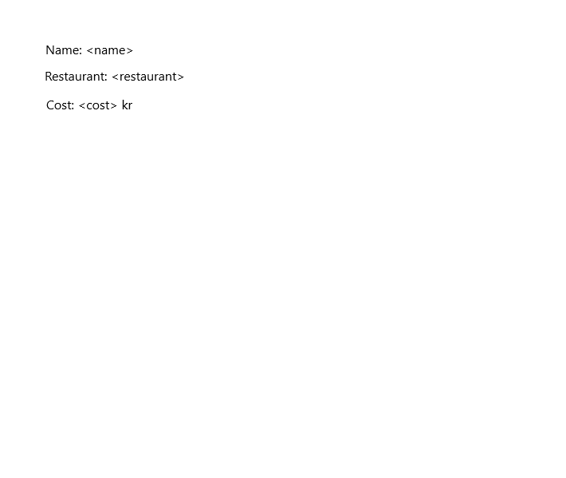
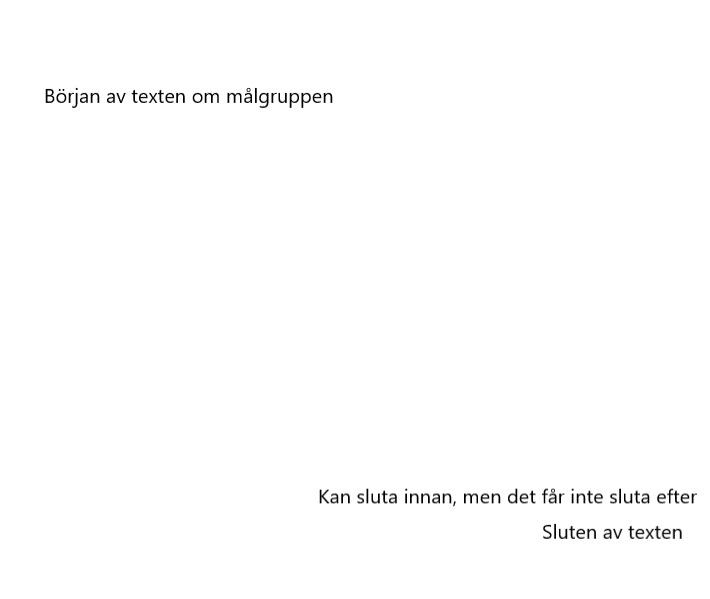
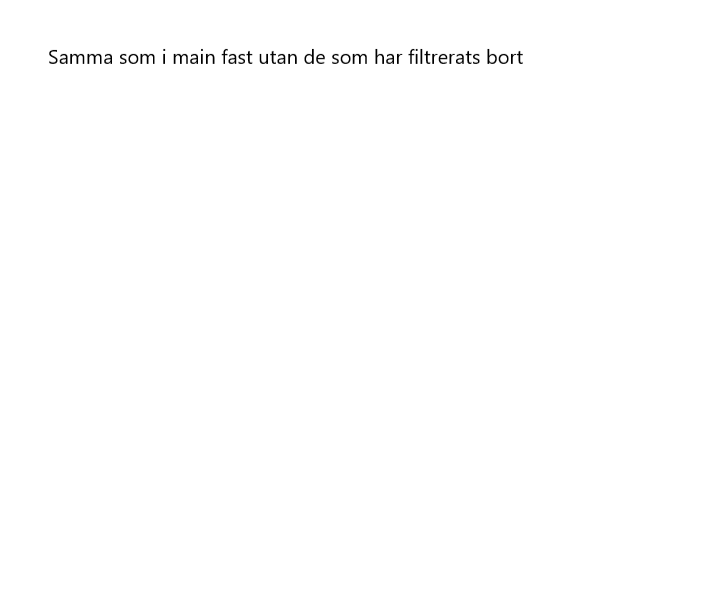

# Rapport

VCS.xml: Lagrar information om inställningarna för Git.
```
<?xml version="1.0" encoding="UTF-8"?>
<project version="4">
  <component name="VcsDirectoryMappings">
    <mapping directory="$PROJECT_DIR$" vcs="Git" />
  </component>
</project>
```

JsonTask.java: Kopierade JsonTask från https://raw.githubusercontent.com/LenaSYS/mobileapp-programming-networking/master/app/src/main/java/com/example/networking/JsonTask.java och ändrade paketet.

```
package com.example.it396gprojekt_uppgiften;

import android.os.AsyncTask;

import java.io.BufferedReader;
import java.io.IOException;
import java.io.InputStream;
import java.io.InputStreamReader;
import java.net.HttpURLConnection;
import java.net.MalformedURLException;
import java.net.URL;

public class JsonTask extends AsyncTask<String, String, String> {

    public interface JsonTaskListener {
        void onPostExecute(String json);
    }

    private HttpURLConnection connection = null;
    private BufferedReader reader = null;
    private final JsonTaskListener listener;

    @SuppressWarnings("deprecation")
    public JsonTask(JsonTaskListener listener) {
        this.listener = listener;
    }

    protected String doInBackground(String... params) {
        try {
            URL url = new URL(params[0]);
            connection = (HttpURLConnection) url.openConnection();
            connection.connect();

            InputStream stream = connection.getInputStream();
            reader = new BufferedReader(new InputStreamReader(stream));

            StringBuilder builder = new StringBuilder();
            String line;
            while ((line = reader.readLine()) != null && !isCancelled()) {
                builder.append(line).append("\n");
            }
            return builder.toString();
        } catch (MalformedURLException e) {
            e.printStackTrace();
        } catch (IOException e) {
            e.printStackTrace();
        } finally {
            if (connection != null) {
                connection.disconnect();
            }
            try {
                if (reader != null) {
                    reader.close();
                }
            } catch (IOException e) {
                e.printStackTrace();
            }
        }
        return null;
    }

    @Override
    protected void onPostExecute(String json) {
        listener.onPostExecute(json);
    }
}
```

item_menu_item.xml: Tre TextViews med ID name_TextView, restaurant_TextView och cost_TextView i en vertikal LinearLayout.

```
<?xml version="1.0" encoding="utf-8"?>
<LinearLayout xmlns:android="http://schemas.android.com/apk/res/android"
    android:orientation="vertical"
    android:layout_width="wrap_content"
    android:layout_height="wrap_content">

    <TextView
        android:id="@+id/name_TextView"
        android:layout_width="wrap_content"
        android:layout_height="wrap_content"/>

    <TextView
        android:id="@+id/restaurant_TextView"
        android:layout_width="wrap_content"
        android:layout_height="wrap_content"/>

    <TextView
        android:id="@+id/cost_TextView"
        android:layout_width="wrap_content"
        android:layout_height="wrap_content"/>

</LinearLayout>
```

MenuItem.java: En klass med variablerna ID, login, name, cost och company som sätts i en konstruktor och som kan hämtas i getters.

```
package com.example.it396gprojekt_uppgiften;

public class MenuItem {
    private String ID;
    private String login;
    private String name;
    private int cost;
    private String company;

    public MenuItem(String ID, String login, String name, int cost, String company) {
        this.ID = ID;
        this.login = login;
        this.name = name;
        this.cost = cost;
        this.company = company;
    }

    public String getID() {
        return ID;
    }

    public String getLogin() {
        return login;
    }

    public String getName() {
        return name;
    }

    public int getCost() {
        return cost;
    }

    public String getCompany() {
        return company;
    }
}
```

MyViewHolder.java: En RecyclerView.ViewHolder som sätter sina TextViews nameTextView, costTextView samt restaurantTextView till 
dem i itemView som har ID name_TextView, restaurant_TextView och cost_TextView.

```
package com.example.it396gprojekt_uppgiften;

import android.view.View;
import android.widget.EditText;
import android.widget.TextView;

import androidx.annotation.NonNull;
import androidx.recyclerview.widget.RecyclerView;

public class MyViewHolder extends RecyclerView.ViewHolder {
    public TextView nameTextView, costTextView, restaurantTextView;

    public MyViewHolder(@NonNull View itemView) {
        super(itemView);
        nameTextView = itemView.findViewById(R.id.name_TextView);
        costTextView = itemView.findViewById(R.id.cost_TextView);
        restaurantTextView = itemView.findViewById(R.id.restaurant_TextView);
    }
}
```

MyAdapter.java: Deklarerar variablerna menuItems, context, nameFilter, restaurantFilter, costFilter samt costSignFilter och initialiserar
dem i konstruktorn.

```
    private ArrayList<MenuItem> menuItems;
    private Context context;
    private String nameFilter, restaurantFilter, costFilter, costSignFilter;

    public MyAdapter(ArrayList<MenuItem> menuItems, Context context, String nameFilter, String restaurantFilter, String costFilter, String costSignFilter) {
        this.menuItems = menuItems;
        this.context = context;
        this.nameFilter = nameFilter;
        this.restaurantFilter = restaurantFilter;
        this.costFilter = costFilter;
        this.costSignFilter = costSignFilter;
    }
```

MyAdapter.java: Fyller en MyViewHolder med en view inflaterat med item_menu_item när den skapas.

```
    @NonNull
    @Override
    public MyViewHolder onCreateViewHolder(@NonNull ViewGroup parent, int viewType) {
        View view = LayoutInflater.from(parent.getContext()).inflate(R.layout.item_menu_item, parent, false);
        return new MyViewHolder(view);
    }
```

MyAdapter.java: Filtrerar menuItems baserat på om dess namm, restaurang och kostnad är samma som deras respektive filter. Om något är 
lika med "" kommer det inte att vara med i filtret. Filtret för kostnaden har en try-catch ifall det inte är en int och catch blocket ignorerar 
filtret. Filtret för kostnaden hanteras olika baserat på värdet på costSignFilter. T.ex. om costSignFilter är "<" måste menuItems kostnad
vara mindre än kostnadsfiltret. Om det inte filtreras bort kommer texterna i nameTextView samt restaurantTextView i holdern sättas till
respektive namn och kostnad för positionen i menuItems. Det sätts också en OnClickListener på nameTextView samt restaurantTextView i
holdern som startar en DetailActivity och skickar med ID för positionen i menuItems när den blir klickad.

```
    @Override
    public void onBindViewHolder(@NonNull MyViewHolder holder, int position) {
        if ((nameFilter.equals("") || nameFilter.equals(menuItems.get(position).getName())) && (restaurantFilter.equals("") || restaurantFilter.equals(menuItems.get(position).getCompany()))){
            if (!costFilter.equals("")){
                try{
                    int cost = Integer.parseInt(costFilter);
                    if (costSignFilter.equals("<")){
                        if (cost > menuItems.get(position).getCost()){
                            holder.nameTextView.setText("Name: " + menuItems.get(position).getName());
                            holder.nameTextView.setOnClickListener(new View.OnClickListener() {
                                @Override
                                public void onClick(View view) {
                                    Intent intent = new Intent(context, DetailActivity.class);
                                    intent.putExtra("ID", menuItems.get(holder.getAdapterPosition()).getID());
                                    context.startActivity(intent);
                                }
                            });
                            holder.restaurantTextView.setText("Restaurant: " + menuItems.get(position).getCompany());
                            holder.restaurantTextView.setOnClickListener(new View.OnClickListener() {
                                @Override
                                public void onClick(View view) {
                                    Intent intent = new Intent(context, DetailActivity.class);
                                    intent.putExtra("ID", menuItems.get(holder.getAdapterPosition()).getID());
                                    context.startActivity(intent);
                                }
                            });
                        }
                    }
                    else if (costSignFilter.equals("<=")){
                        if (cost >= menuItems.get(position).getCost()){
                            holder.nameTextView.setText("Name: " + menuItems.get(position).getName());
                            holder.nameTextView.setOnClickListener(new View.OnClickListener() {
                                @Override
                                public void onClick(View view) {
                                    Intent intent = new Intent(context, DetailActivity.class);
                                    intent.putExtra("ID", menuItems.get(holder.getAdapterPosition()).getID());
                                    context.startActivity(intent);
                                }
                            });
                            holder.restaurantTextView.setText("Restaurant: " + menuItems.get(position).getCompany());
                            holder.restaurantTextView.setOnClickListener(new View.OnClickListener() {
                                @Override
                                public void onClick(View view) {
                                    Intent intent = new Intent(context, DetailActivity.class);
                                    intent.putExtra("ID", menuItems.get(holder.getAdapterPosition()).getID());
                                    context.startActivity(intent);
                                }
                            });
                        }
                    }
                    else if (costSignFilter.equals("=")){
                        if (cost == menuItems.get(position).getCost()){
                            holder.nameTextView.setText("Name: " + menuItems.get(position).getName());
                            holder.nameTextView.setOnClickListener(new View.OnClickListener() {
                                @Override
                                public void onClick(View view) {
                                    Intent intent = new Intent(context, DetailActivity.class);
                                    intent.putExtra("ID", menuItems.get(holder.getAdapterPosition()).getID());
                                    context.startActivity(intent);
                                }
                            });
                            holder.restaurantTextView.setText("Restaurant: " + menuItems.get(position).getCompany());
                            holder.restaurantTextView.setOnClickListener(new View.OnClickListener() {
                                @Override
                                public void onClick(View view) {
                                    Intent intent = new Intent(context, DetailActivity.class);
                                    intent.putExtra("ID", menuItems.get(holder.getAdapterPosition()).getID());
                                    context.startActivity(intent);
                                }
                            });
                        }
                    }
                    else if (costSignFilter.equals("=>")){
                        if (cost <= menuItems.get(position).getCost()){
                            holder.nameTextView.setText("Name: " + menuItems.get(position).getName());
                            holder.nameTextView.setOnClickListener(new View.OnClickListener() {
                                @Override
                                public void onClick(View view) {
                                    Intent intent = new Intent(context, DetailActivity.class);
                                    intent.putExtra("ID", menuItems.get(holder.getAdapterPosition()).getID());
                                    context.startActivity(intent);
                                }
                            });
                            holder.restaurantTextView.setText("Restaurant: " + menuItems.get(position).getCompany());
                            holder.restaurantTextView.setOnClickListener(new View.OnClickListener() {
                                @Override
                                public void onClick(View view) {
                                    Intent intent = new Intent(context, DetailActivity.class);
                                    intent.putExtra("ID", menuItems.get(holder.getAdapterPosition()).getID());
                                    context.startActivity(intent);
                                }
                            });
                        }
                    }
                    else if (costSignFilter.equals(">")){
                        if (cost < menuItems.get(position).getCost()){
                            holder.nameTextView.setText("Name: " + menuItems.get(position).getName());
                            holder.nameTextView.setOnClickListener(new View.OnClickListener() {
                                @Override
                                public void onClick(View view) {
                                    Intent intent = new Intent(context, DetailActivity.class);
                                    intent.putExtra("ID", menuItems.get(holder.getAdapterPosition()).getID());
                                    context.startActivity(intent);
                                }
                            });
                            holder.restaurantTextView.setText("Restaurant: " + menuItems.get(position).getCompany());
                            holder.restaurantTextView.setOnClickListener(new View.OnClickListener() {
                                @Override
                                public void onClick(View view) {
                                    Intent intent = new Intent(context, DetailActivity.class);
                                    intent.putExtra("ID", menuItems.get(holder.getAdapterPosition()).getID());
                                    context.startActivity(intent);
                                }
                            });
                        }
                    }
                }catch(Exception e){
                    holder.nameTextView.setText("Name: " + menuItems.get(position).getName());
                    holder.nameTextView.setOnClickListener(new View.OnClickListener() {
                        @Override
                        public void onClick(View view) {
                            Intent intent = new Intent(context, DetailActivity.class);
                            intent.putExtra("ID", menuItems.get(holder.getAdapterPosition()).getID());
                            context.startActivity(intent);
                        }
                    });
                    holder.restaurantTextView.setText("Restaurant: " + menuItems.get(position).getCompany());
                    holder.restaurantTextView.setOnClickListener(new View.OnClickListener() {
                        @Override
                        public void onClick(View view) {
                            Intent intent = new Intent(context, DetailActivity.class);
                            intent.putExtra("ID", menuItems.get(holder.getAdapterPosition()).getID());
                            context.startActivity(intent);
                        }
                    });
                }
            }else {
                holder.nameTextView.setText("Name: " + menuItems.get(position).getName());
                holder.nameTextView.setOnClickListener(new View.OnClickListener() {
                    @Override
                    public void onClick(View view) {
                        Intent intent = new Intent(context, DetailActivity.class);
                        intent.putExtra("ID", menuItems.get(holder.getAdapterPosition()).getID());
                        context.startActivity(intent);
                    }
                });
                holder.restaurantTextView.setText("Restaurant: " + menuItems.get(position).getCompany());
                holder.restaurantTextView.setOnClickListener(new View.OnClickListener() {
                    @Override
                    public void onClick(View view) {
                        Intent intent = new Intent(context, DetailActivity.class);
                        intent.putExtra("ID", menuItems.get(holder.getAdapterPosition()).getID());
                        context.startActivity(intent);
                    }
                });
            }
        }
    }
```

MyAdapter.java: Returnerar hur många MenuItem det finns i menuItems.

```
    @Override
    public int getItemCount() {
        return menuItems.size();
    }
```

activity_about.xml: En WebView med ID my_webview och en Button med ID back_button i en ConstraintLayout.

```
<?xml version="1.0" encoding="utf-8"?>
<androidx.constraintlayout.widget.ConstraintLayout xmlns:android="http://schemas.android.com/apk/res/android"
    xmlns:app="http://schemas.android.com/apk/res-auto"
    xmlns:tools="http://schemas.android.com/tools"
    android:layout_width="match_parent"
    android:layout_height="match_parent"
    tools:context=".AboutActivity">

    <WebView
        android:id="@+id/my_webview"
        android:layout_width="wrap_content"
        android:layout_height="wrap_content"
        app:layout_constraintBottom_toBottomOf="parent"
        app:layout_constraintLeft_toLeftOf="parent"
        app:layout_constraintRight_toRightOf="parent"
        app:layout_constraintTop_toTopOf="parent" />

    <Button
        android:id="@+id/back_button"
        android:layout_width="wrap_content"
        android:layout_height="wrap_content"
        android:text="Back"
        app:layout_constraintBottom_toBottomOf="parent"
        app:layout_constraintLeft_toLeftOf="parent"
        app:layout_constraintRight_toRightOf="parent" />

</androidx.constraintlayout.widget.ConstraintLayout>
```

about.html: Header med text som beskriver målgruppen.

```
<html>
<body>
<h1>This app is for english speakers who want to search menu items in Skövde.
    It's for those who already know what they want and search by name,
    those who know what they want to pay and search by cost,
    those that know where they want to eat and search by restaurant,
    or any combination of the three.</h1>
</body>
</html>
```

AboutActivity.java: Laddar in about.html i my_webview och sätter en OnClickListener på back_button som avslutar aktiviteten när den blir 
klickad.

```
package com.example.it396gprojekt_uppgiften;

import androidx.appcompat.app.AppCompatActivity;

import android.os.Bundle;
import android.view.View;
import android.webkit.WebView;
import android.webkit.WebViewClient;
import android.widget.Button;

public class AboutActivity extends AppCompatActivity {

    private WebView myWebView;
    private Button backButton;

    @Override
    protected void onCreate(Bundle savedInstanceState) {
        super.onCreate(savedInstanceState);
        setContentView(R.layout.activity_about);

        myWebView = findViewById(R.id.my_webview);
        myWebView.setWebViewClient(new WebViewClient());
        myWebView.getSettings().setJavaScriptEnabled(true);

        myWebView.loadUrl("file:///android_asset/about.html");

        backButton = findViewById(R.id.back_button);
        backButton.setOnClickListener(new View.OnClickListener() {
            @Override
            public void onClick(View view) {
                finish();
            }
        });
    }
}
```

AndroidManifest.xml: Ger tillstånd att använda internet.

```
    <uses-permission android:name="android.permission.INTERNET"/>
```

activity_main.xml: En RecyclerView med ID recycler_view, en Button med ID about_button och en Button med ID search_button i en 
ConstraintLayout.

```
<?xml version="1.0" encoding="utf-8"?>
<androidx.constraintlayout.widget.ConstraintLayout xmlns:android="http://schemas.android.com/apk/res/android"
    xmlns:app="http://schemas.android.com/apk/res-auto"
    xmlns:tools="http://schemas.android.com/tools"
    android:layout_width="match_parent"
    android:layout_height="match_parent"
    tools:context=".MainActivity">

    <androidx.recyclerview.widget.RecyclerView
        android:id="@+id/recycler_view"
        android:layout_width="400dp"
        android:layout_height="650dp"
        android:text="Hello World!"
        app:layout_constraintLeft_toLeftOf="parent"
        app:layout_constraintRight_toRightOf="parent"
        app:layout_constraintTop_toTopOf="parent" />

    <Button
        android:id="@+id/about_button"
        android:layout_width="wrap_content"
        android:layout_height="wrap_content"
        android:text="About"
        app:layout_constraintBottom_toBottomOf="parent"
        app:layout_constraintLeft_toLeftOf="parent" />

    <Button
        android:id="@+id/search_button"
        android:layout_width="wrap_content"
        android:layout_height="wrap_content"
        android:text="Search"
        app:layout_constraintBottom_toBottomOf="parent"
        app:layout_constraintRight_toRightOf="parent" />

</androidx.constraintlayout.widget.ConstraintLayout>
```

MainActivity.java: Deklarerar variabler som ska användas. JSON_URL initialiseras till kursens webbtjänst som har datan som ska
hämtas. Strängerna name, restaurant, cost och costSign initialiseras till "" för att filtrena ska vara tommma i början.

```
    private Button aboutButton, searchButton;
    private final String JSON_URL = "https://mobprog.webug.se/json-api?login=a19clasv";
    private ArrayList<MenuItem> menuItems;
    private RecyclerView.Adapter adapter;
    private RecyclerView recyclerView;
    private SharedPreferences preferences;
    private String name = "", restaurant = "", cost = "", costSign = "";
```

MainActivity.java: När klassen skapas kommer den sätta preferences till de delade, hitta about_button och sätta en OnClickListener som 
startar AboutActivity, hitta search_button och sätta en OnClickListener som startar SearchActivity samt hitta recycler_view och sätta en
ny LinearLayoutManager på den.

```
    @Override
    protected void onCreate(Bundle savedInstanceState) {
        super.onCreate(savedInstanceState);
        setContentView(R.layout.activity_main);

        preferences = getSharedPreferences("preferences", MODE_PRIVATE);

        aboutButton = findViewById(R.id.about_button);
        aboutButton.setOnClickListener(new View.OnClickListener() {
            @Override
            public void onClick(View view) {
                Intent intent = new Intent(MainActivity.this, AboutActivity.class);
                startActivity(intent);
            }
        });

        searchButton = findViewById(R.id.search_button);
        searchButton.setOnClickListener(new View.OnClickListener() {
            @Override
            public void onClick(View view) {
                Intent intent = new Intent(MainActivity.this, SearchActivity.class);
                startActivity(intent);
            }
        });

        recyclerView = findViewById(R.id.recycler_view);
        recyclerView.setLayoutManager(new LinearLayoutManager(this));
    }
```

MainActivity.java: När klassen resumeras kommer filtrena hämtas, sättas till "" om det inte finns något att hämta, och det skapas en ny 
JsonTask som kommer att hämta Json från JSON_URL.

```
    @Override
    protected void onResume() {
        super.onResume();

        name = preferences.getString("name", "");
        restaurant = preferences.getString("restaurant", "");
        cost = preferences.getString("cost", "");
        costSign = preferences.getString("costSign", "");

        new JsonTask(this).execute(JSON_URL);
    }
```

MainActivity.java: Efter JsonTask har hämtat Json från JSON_URL kommer den använda Gson för att omvandla det till menyalternativ 
som kommer visas upp i recyclerView efter de har blivit adapterade med filtrena i en MyAdapter.

```
    @Override
    public void onPostExecute(String json) {
        Gson gson = new Gson();

        Type type = new TypeToken<ArrayList<MenuItem>>() {}.getType();
        menuItems = gson.fromJson(json, type);
        adapter = new MyAdapter(menuItems, MainActivity.this, name, restaurant, cost, costSign);
        recyclerView.setAdapter(adapter);
    }
```

build.gradle: Lade till gson i dependencies.

```
    implementation 'com.google.code.gson:gson:2.9.0'
```

build.gradle: Kopierade arkiverings-konfigurationen från 
https://github.com/LenaSYS/mobileapp-programming-project/blob/master/app/build.gradle.

```
task archive(type: Zip) {
    def projectDir = "${projectDir.parentFile}/"
    delete fileTree(projectDir) {
        include '*.zip'
    }

    def projectDirFile = new File(projectDir)
    from projectDirFile
    destinationDirectory = projectDirFile
    include '**'
    exclude '*.zip'
    exclude '**/*.lock'
    exclude 'app/build'
    archiveFileName = {
        def stdout = new ByteArrayOutputStream()
        exec {
            commandLine 'git', 'describe', '--match=', '--always', '--dirty', '--abbrev=7'
            standardOutput = stdout
        }
        "assignment_"+stdout.toString().trim()
    }() + ".zip"
}
```

activity_detail.xml: En RecyclerView med ID recycler_view och en Button med ID back_button i en
ConstraintLayout.

```
<?xml version="1.0" encoding="utf-8"?>
<androidx.constraintlayout.widget.ConstraintLayout xmlns:android="http://schemas.android.com/apk/res/android"
    xmlns:app="http://schemas.android.com/apk/res-auto"
    xmlns:tools="http://schemas.android.com/tools"
    android:layout_width="match_parent"
    android:layout_height="match_parent"
    tools:context=".DetailActivity">

    <androidx.recyclerview.widget.RecyclerView
        android:id="@+id/recycler_view"
        android:layout_width="400dp"
        android:layout_height="650dp"
        android:text="Hello World!"
        app:layout_constraintLeft_toLeftOf="parent"
        app:layout_constraintRight_toRightOf="parent"
        app:layout_constraintTop_toTopOf="parent" />

    <Button
        android:id="@+id/back_button"
        android:layout_width="wrap_content"
        android:layout_height="wrap_content"
        android:text="Back"
        app:layout_constraintBottom_toBottomOf="parent"
        app:layout_constraintLeft_toLeftOf="parent"
        app:layout_constraintRight_toRightOf="parent" />

</androidx.constraintlayout.widget.ConstraintLayout>
```

DetailAdapter.java: Deklarerar variablerna och initialiserar dem i en konstruktor.

```
    private ArrayList<MenuItem> menuItems;
    private String ID;

    public  DetailAdapter(ArrayList<MenuItem> menuItems, String ID){
        this.menuItems = menuItems;
        this.ID = ID;
    }
```

DetailAdapter.java: Fyller en MyViewHolder med en view inflaterat med item_menu_item när den skapas.

```
    @NonNull
    @Override
    public MyViewHolder onCreateViewHolder(@NonNull ViewGroup parent, int viewType) {
        View view = LayoutInflater.from(parent.getContext()).inflate(R.layout.item_menu_item, parent, false);
        return new MyViewHolder(view);
    }
```

DetailAdapter.java: Filtrerar menuItems så att bara den som har samma ID som den som blev satt i konstruktorn får nameTextView, 
costTextView samt restaurantTextView i holdern satta till respektive namn, kostnad och restaurang för positionen i menuItems.

```
    @Override
    public void onBindViewHolder(@NonNull MyViewHolder holder, int position) {
        if(menuItems.get(position).getID().equals(ID)) {
            holder.nameTextView.setText("Name: " + menuItems.get(position).getName());
            holder.costTextView.setText("Cost: " + menuItems.get(position).getCost() + " kr");
            holder.restaurantTextView.setText("Restaurant: " + menuItems.get(position).getCompany());
        }
    }
```

DetailAdapter.java: Returnerar hur många MenuItem det finns i menuItems.

```
    @Override
    public int getItemCount() {
        return menuItems.size();
    }
```

DetailActivity.java: Deklarerar variabler som ska användas. JSON_URL initialiseras till kursens webbtjänst som har datan som ska
hämtas.

```
private Button backButton;
    private final String JSON_URL = "https://mobprog.webug.se/json-api?login=a19clasv";
    private ArrayList<MenuItem> menuItems;
    private RecyclerView.Adapter adapter;
    private RecyclerView recyclerView;
    private String ID;
```

DetailActivity.java: När klassen skapas kommer klassens ID att sättas till den ID som skickades med, back_button hittas och får en 
OnClickListener som stänger aktiviteten när den klickas, recycler_view hittas plus att en LinearLayoutManager sätts till den och det
skapas en ny JsonTask som kommer att hämta Json från JSON_URL.

```
    @Override
    protected void onCreate(Bundle savedInstanceState) {
        super.onCreate(savedInstanceState);
        setContentView(R.layout.activity_detail);

        Bundle extras = getIntent().getExtras();
        if (extras != null) {
            ID = extras.getString("ID");
        }

        backButton = findViewById(R.id.back_button);
        backButton.setOnClickListener(new View.OnClickListener() {
            @Override
            public void onClick(View view) {
                finish();
            }
        });

        recyclerView = findViewById(R.id.recycler_view);
        recyclerView.setLayoutManager(new LinearLayoutManager(this));

        new JsonTask(this).execute(JSON_URL);
    }
```

DetailActivity.java: Efter JsonTask har hämtat Json från JSON_URL kommer den använda Gson för att omvandla det till menyalternativ
som kommer visas upp i recyclerView efter de har blivit adapterade med ID filtret i en DetailAdapter.

```
    @Override
    public void onPostExecute(String json) {
        Gson gson = new Gson();

        Type type = new TypeToken<ArrayList<MenuItem>>() {}.getType();
        menuItems = gson.fromJson(json, type);
        adapter = new DetailAdapter(menuItems, ID);
        recyclerView.setAdapter(adapter);
    }
```

activity_search.xml: En TextView med ID name_TextView, en EditText med ID name_EditText, en TextView med ID restaurant_TextView, 
en EditText med ID restaurant_EditText, en TextView med ID cost_TextView, många Button med symbolerna "<", "<=", "=", "=>" samt ">" 
med ID som passar deras symboler, t.ex. equal_button med symbolen "=", en EditText med ID cost_EditText och en Button med ID 
search_Button.

```
<?xml version="1.0" encoding="utf-8"?>
<androidx.constraintlayout.widget.ConstraintLayout xmlns:android="http://schemas.android.com/apk/res/android"
    xmlns:app="http://schemas.android.com/apk/res-auto"
    xmlns:tools="http://schemas.android.com/tools"
    android:layout_width="match_parent"
    android:layout_height="match_parent"
    tools:context=".SearchActivity">

    <TextView
        android:id="@+id/name_TextView"
        android:layout_width="wrap_content"
        android:layout_height="wrap_content"
        android:layout_marginLeft="30dp"
        android:layout_marginTop="80dp"
        android:text="Name:"
        app:layout_constraintStart_toStartOf="parent"
        app:layout_constraintTop_toTopOf="parent" />

    <EditText
        android:id="@+id/name_EditText"
        android:layout_width="330dp"
        android:layout_height="wrap_content"
        android:layout_marginTop="60dp"
        app:layout_constraintStart_toEndOf="@+id/name_TextView"
        app:layout_constraintTop_toTopOf="parent" />

    <TextView
        android:id="@+id/restaurant_TextView"
        android:layout_width="wrap_content"
        android:layout_height="wrap_content"
        android:layout_marginLeft="30dp"
        android:layout_marginTop="160dp"
        android:text="Restaurant:"
        app:layout_constraintStart_toStartOf="parent"
        app:layout_constraintTop_toTopOf="parent" />

    <EditText
        android:id="@+id/restaurant_EditText"
        android:layout_width="300dp"
        android:layout_height="wrap_content"
        android:layout_marginTop="140dp"
        app:layout_constraintStart_toEndOf="@+id/restaurant_TextView"
        app:layout_constraintTop_toTopOf="parent" />

    <TextView
        android:id="@+id/cost_TextView"
        android:layout_width="wrap_content"
        android:layout_height="wrap_content"
        android:layout_marginLeft="30dp"
        android:layout_marginTop="240dp"
        android:text="Cost:"
        app:layout_constraintStart_toStartOf="parent"
        app:layout_constraintTop_toTopOf="parent" />

    <Button
        android:id="@+id/less_than_Button"
        android:layout_width="40dp"
        android:layout_height="wrap_content"
        android:layout_marginLeft="4dp"
        android:layout_marginTop="50dp"
        android:text="&lt;"
        app:layout_constraintStart_toEndOf="@+id/cost_TextView"
        app:layout_constraintTop_toBottomOf="@+id/restaurant_TextView" />

    <Button
        android:id="@+id/less_than_or_equal_Button"
        android:layout_width="50dp"
        android:layout_height="wrap_content"
        android:layout_marginLeft="4dp"
        android:layout_marginTop="50dp"
        android:text="&lt;="
        app:layout_constraintStart_toEndOf="@+id/less_than_Button"
        app:layout_constraintTop_toBottomOf="@+id/restaurant_TextView" />

    <Button
        android:id="@+id/equal_Button"
        android:layout_width="40dp"
        android:layout_height="wrap_content"
        android:layout_marginLeft="4dp"
        android:layout_marginTop="50dp"
        android:text="="
        app:layout_constraintStart_toEndOf="@+id/less_than_or_equal_Button"
        app:layout_constraintTop_toBottomOf="@+id/restaurant_TextView" />

    <Button
        android:id="@+id/greater_than_or_equal_Button"
        android:layout_width="50dp"
        android:layout_height="wrap_content"
        android:layout_marginLeft="4dp"
        android:layout_marginTop="50dp"
        android:text="=>"
        app:layout_constraintStart_toEndOf="@+id/equal_Button"
        app:layout_constraintTop_toBottomOf="@+id/restaurant_TextView" />

    <Button
        android:id="@+id/greater_than_Button"
        android:layout_width="50dp"
        android:layout_height="wrap_content"
        android:layout_marginLeft="4dp"
        android:layout_marginTop="50dp"
        android:text="&gt;"
        app:layout_constraintStart_toEndOf="@+id/greater_than_or_equal_Button"
        app:layout_constraintTop_toBottomOf="@+id/restaurant_TextView" />

    <EditText
        android:id="@+id/cost_EditText"
        android:layout_width="90dp"
        android:layout_height="wrap_content"
        android:layout_marginTop="240dp"
        app:layout_constraintStart_toEndOf="@+id/greater_than_Button"
        app:layout_constraintTop_toTopOf="parent" />

    <Button
        android:id="@+id/search_Button"
        android:layout_width="wrap_content"
        android:layout_height="wrap_content"
        android:text="Search"
        app:layout_constraintBottom_toBottomOf="parent"
        app:layout_constraintEnd_toEndOf="parent"
        app:layout_constraintStart_toStartOf="parent" />

</androidx.constraintlayout.widget.ConstraintLayout>
```

SearchActivity.java: Initialiserar costSign till "", sätter den till olika värden beroende på vilken symbol knappen som trycktes hade om
en knapp med en symbol trycks och sen om search_Button trycks hämtas alla texterna från EditTexterna name_EditText, 
restaurant_EditText samt cost_EditText och sparas tillsammans med costSign i delade preferences, efter vilket aktiviteten avslutas.


```
package com.example.it396gprojekt_uppgiften;

import androidx.appcompat.app.AppCompatActivity;

import android.content.SharedPreferences;
import android.os.Bundle;
import android.util.Log;
import android.view.View;
import android.widget.Button;
import android.widget.EditText;

public class SearchActivity extends AppCompatActivity {
    private EditText name, restaurant, cost;
    private Button lessThan, lessThanOrEqual, equal, greaterThanOrEqual, greaterThan;
    private String costSign = "";
    SharedPreferences preferences;
    SharedPreferences.Editor editor;

    @Override
    protected void onCreate(Bundle savedInstanceState) {
        super.onCreate(savedInstanceState);
        setContentView(R.layout.activity_search);

        preferences = getSharedPreferences("preferences", MODE_PRIVATE);
        editor = preferences.edit();

        lessThan = findViewById(R.id.less_than_Button);
        lessThan.setOnClickListener(new View.OnClickListener() {
            @Override
            public void onClick(View view) {
                costSign = "<";
            }
        });

        lessThanOrEqual = findViewById(R.id.less_than_or_equal_Button);
        lessThanOrEqual.setOnClickListener(new View.OnClickListener() {
            @Override
            public void onClick(View view) {
                costSign = "<=";
            }
        });

        equal = findViewById(R.id.equal_Button);
        equal.setOnClickListener(new View.OnClickListener() {
            @Override
            public void onClick(View view) {
                costSign = "=";
            }
        });

        greaterThanOrEqual = findViewById(R.id.greater_than_or_equal_Button);
        greaterThanOrEqual.setOnClickListener(new View.OnClickListener() {
            @Override
            public void onClick(View view) {
                costSign = "=>";
            }
        });

        greaterThan = findViewById(R.id.greater_than_Button);
        greaterThan.setOnClickListener(new View.OnClickListener() {
            @Override
            public void onClick(View view) {
                costSign = ">";
            }
        });

        Button searchButton = findViewById(R.id.search_Button);
        searchButton.setOnClickListener(new View.OnClickListener() {
            @Override
            public void onClick(View view) {
                name = findViewById(R.id.name_EditText);
                String nameText = name.getText().toString();
                editor.putString("name", nameText);

                restaurant = findViewById(R.id.restaurant_EditText);
                String restaurantText = restaurant.getText().toString();
                editor.putString("restaurant", restaurantText);

                cost = findViewById(R.id.cost_EditText);
                String costText = cost.getText().toString();
                editor.putString("cost", costText);

                editor.putString("costSign", costSign);

                editor.apply();

                finish();
            }
        });
    }
}
```

.gitignore: Kopierade gitignore filen från https://github.com/LenaSYS/mobileapp-programming-project/blob/master/.gitignore.

```
# Built application files
*.apk
*.ap_
*.aab

# Files for the ART/Dalvik VM
*.dex

# Generated files
bin/
gen/
out/
app/release/

# Gradle files
.gradle/
build/

# Local configuration file (sdk path, etc)
local.properties

# Log Files
*.log

# Android Studio Navigation editor temp files
.navigation/

# Android Studio captures folder
captures/

# IntelliJ
*.iml
.idea

# External native build folder generated in Android Studio 2.2 and later
.externalNativeBuild

# macOS
.DS_Store

# Other
*.zip
```

Skärmdump av huvudskärmen med alla menyalternativens namn och restauranger.



Skärmdump av detaljskärmen efter en "Wagyu burger" från "Alberts bar och grill" har klickats i huvudskärmen med namnet, restaurangen
och kostnaden för den.



Skärmdump av "about"-skärmen som visar målgruppen.



Skärmdump av sökskärmen med "Irish coffee" som namn, "Alberts bar och grill" som restaurang och 59 som kostnad insatt i "EditTexts".



Skärmdump av huvudskärmen när den bara visar upp "Irish coffee" från "Alberts bar och grill" för att det var det enda som klarade sig 
igenom filtret som skrevs in i sökskärmen.



Skiss/design-idé:

Skiss för huvudskärmen.



Skiss för sökskärmen.



Skiss för detaljskärmen.



Skiss för about-skärmen.



Skiss för huvudskärmen efter den har blivit filtrerad.



Webbtjänst - JSON:

Exempel-objekt

```
{
  "ID": "a19clasv_Bombe_glacée_strawberry",
  "name": "Bombe glacée strawberry",
  "type": "a19clasv",
  "company": "Skovdes gelateria",
  "location": "",
  "category": "",
  "size": 0,
  "cost": 279,
  "auxdata": ""
}
```

Attributet "name" innehåller menyalternativets namn.
Attributet "company" innehåller menyalternativets restaurang.
Attributet "size" betyder inget, den sätts bara alltid till 0 även om man inte använder den.
Attributet "cost" innehåller menyalternativets kostnad.

Implementationsexempel:

Presentera en tydligt definierad målgrupp för appen beskriven på en "about"-skärm. About-skärmen skall vara en egen aktivitet.

Figur 1


Figur 2
```
public class AboutActivity extends AppCompatActivity {

    private WebView myWebView;
    private Button backButton;

    @Override
    protected void onCreate(Bundle savedInstanceState) {
        super.onCreate(savedInstanceState);
        setContentView(R.layout.activity_about);

        myWebView = findViewById(R.id.my_webview);
        myWebView.setWebViewClient(new WebViewClient());
        myWebView.getSettings().setJavaScriptEnabled(true);

        myWebView.loadUrl("file:///android_asset/about.html");

        backButton = findViewById(R.id.back_button);
        backButton.setOnClickListener(new View.OnClickListener() {
            @Override
            public void onClick(View view) {
                finish();
            }
        });
    }
}
```

Figur 3
```
<?xml version="1.0" encoding="utf-8"?>
<androidx.constraintlayout.widget.ConstraintLayout xmlns:android="http://schemas.android.com/apk/res/android"
    xmlns:app="http://schemas.android.com/apk/res-auto"
    xmlns:tools="http://schemas.android.com/tools"
    android:layout_width="match_parent"
    android:layout_height="match_parent"
    tools:context=".AboutActivity">

    <WebView
        android:id="@+id/my_webview"
        android:layout_width="wrap_content"
        android:layout_height="wrap_content"
        app:layout_constraintBottom_toBottomOf="parent"
        app:layout_constraintLeft_toLeftOf="parent"
        app:layout_constraintRight_toRightOf="parent"
        app:layout_constraintTop_toTopOf="parent" />

    <Button
        android:id="@+id/back_button"
        android:layout_width="wrap_content"
        android:layout_height="wrap_content"
        android:text="Back"
        app:layout_constraintBottom_toBottomOf="parent"
        app:layout_constraintLeft_toLeftOf="parent"
        app:layout_constraintRight_toRightOf="parent" />

</androidx.constraintlayout.widget.ConstraintLayout>
```

Figur 4
```
<html>
<body>
<h1>This app is for english speakers who want to search menu items in Skövde.
    It's for those who already know what they want and search by name,
    those who know what they want to pay and search by cost,
    those that know where they want to eat and search by restaurant,
    or any combination of the three.</h1>
</body>
</html>
```

Beskrivning: Klassen i figur 2 är en egen aktivitet som vid skapning hämtar my_webview i figur 3 och laddar about.html med beskrivningen om
målgruppen i figur 4 i my_webview. Resultatet syns i figur 1 där målgruppen beskrivs.

Commit för activity_about.xml: b078bc61842c6b95e3351f5af31ad408b171b357

Commit för AboutActivity.java: commit f4bee587b153546c28715a4368e951c76911b0d8

Commit för about.html: c0611f5041f16f10e642801554bb1d4d89feaabc

Minst ett attribut från appens JSON-data skall presenteras i en RecyclerView och JSON-data till appen skall komma från kursens webbtjänst.

Figur 5


Figur 6
```
public class MenuItem {
    private String ID;
    private String login;
    private String name;
    private int cost;
    private String company;

    public MenuItem(String ID, String login, String name, int cost, String company) {
        this.ID = ID;
        this.login = login;
        this.name = name;
        this.cost = cost;
        this.company = company;
    }

    public String getID() {
        return ID;
    }

    public String getLogin() {
        return login;
    }

    public String getName() {
        return name;
    }

    public int getCost() {
        return cost;
    }

    public String getCompany() {
        return company;
    }
}
```

Figur 7
```
public class JsonTask extends AsyncTask<String, String, String> {

    public interface JsonTaskListener {
        void onPostExecute(String json);
    }

    private HttpURLConnection connection = null;
    private BufferedReader reader = null;
    private final JsonTaskListener listener;

    @SuppressWarnings("deprecation")
    public JsonTask(JsonTaskListener listener) {
        this.listener = listener;
    }

    protected String doInBackground(String... params) {
        try {
            URL url = new URL(params[0]);
            connection = (HttpURLConnection) url.openConnection();
            connection.connect();

            InputStream stream = connection.getInputStream();
            reader = new BufferedReader(new InputStreamReader(stream));

            StringBuilder builder = new StringBuilder();
            String line;
            while ((line = reader.readLine()) != null && !isCancelled()) {
                builder.append(line).append("\n");
            }
            return builder.toString();
        } catch (MalformedURLException e) {
            e.printStackTrace();
        } catch (IOException e) {
            e.printStackTrace();
        } finally {
            if (connection != null) {
                connection.disconnect();
            }
            try {
                if (reader != null) {
                    reader.close();
                }
            } catch (IOException e) {
                e.printStackTrace();
            }
        }
        return null;
    }

    @Override
    protected void onPostExecute(String json) {
        listener.onPostExecute(json);
    }
}
```

Figur 8
```
public class MainActivity extends AppCompatActivity implements JsonTask.JsonTaskListener {

    private Button aboutButton, searchButton;
    private final String JSON_URL = "https://mobprog.webug.se/json-api?login=a19clasv";
    private ArrayList<MenuItem> menuItems;
    private RecyclerView.Adapter adapter;
    private RecyclerView recyclerView;
    private SharedPreferences preferences;
    private String name = "", restaurant = "", cost = "", costSign = "";

    @Override
    protected void onCreate(Bundle savedInstanceState) {
        super.onCreate(savedInstanceState);
        setContentView(R.layout.activity_main);

        preferences = getSharedPreferences("preferences", MODE_PRIVATE);

        aboutButton = findViewById(R.id.about_button);
        aboutButton.setOnClickListener(new View.OnClickListener() {
            @Override
            public void onClick(View view) {
                Intent intent = new Intent(MainActivity.this, AboutActivity.class);
                startActivity(intent);
            }
        });

        searchButton = findViewById(R.id.search_button);
        searchButton.setOnClickListener(new View.OnClickListener() {
            @Override
            public void onClick(View view) {
                Intent intent = new Intent(MainActivity.this, SearchActivity.class);
                startActivity(intent);
            }
        });

        recyclerView = findViewById(R.id.recycler_view);
        recyclerView.setLayoutManager(new LinearLayoutManager(this));
    }

    @Override
    public void onPostExecute(String json) {
        Gson gson = new Gson();

        Type type = new TypeToken<ArrayList<MenuItem>>() {}.getType();
        menuItems = gson.fromJson(json, type);
        adapter = new MyAdapter(menuItems, MainActivity.this, name, restaurant, cost, costSign);
        recyclerView.setAdapter(adapter);
    }

    @Override
    protected void onResume() {
        super.onResume();

        name = preferences.getString("name", "");
        restaurant = preferences.getString("restaurant", "");
        cost = preferences.getString("cost", "");
        costSign = preferences.getString("costSign", "");

        new JsonTask(this).execute(JSON_URL);
    }
}
```

Figur 9
```
public class MyAdapter extends RecyclerView.Adapter<MyViewHolder> {

    private ArrayList<MenuItem> menuItems;
    private Context context;
    private String nameFilter, restaurantFilter, costFilter, costSignFilter;

    public MyAdapter(ArrayList<MenuItem> menuItems, Context context, String nameFilter, String restaurantFilter, String costFilter, String costSignFilter) {
        this.menuItems = menuItems;
        this.context = context;
        this.nameFilter = nameFilter;
        this.restaurantFilter = restaurantFilter;
        this.costFilter = costFilter;
        this.costSignFilter = costSignFilter;
    }

    @NonNull
    @Override
    public MyViewHolder onCreateViewHolder(@NonNull ViewGroup parent, int viewType) {
        View view = LayoutInflater.from(parent.getContext()).inflate(R.layout.item_menu_item, parent, false);
        return new MyViewHolder(view);
    }

    @Override
    public void onBindViewHolder(@NonNull MyViewHolder holder, int position) {
        if ((nameFilter.equals("") || nameFilter.equals(menuItems.get(position).getName())) && (restaurantFilter.equals("") || restaurantFilter.equals(menuItems.get(position).getCompany()))){
            if (!costFilter.equals("")){
                try{
                    int cost = Integer.parseInt(costFilter);
                    if (costSignFilter.equals("<")){
                        if (cost > menuItems.get(position).getCost()){
                            holder.nameTextView.setText("Name: " + menuItems.get(position).getName());
                            holder.nameTextView.setOnClickListener(new View.OnClickListener() {
                                @Override
                                public void onClick(View view) {
                                    Intent intent = new Intent(context, DetailActivity.class);
                                    intent.putExtra("ID", menuItems.get(holder.getAdapterPosition()).getID());
                                    context.startActivity(intent);
                                }
                            });
                            holder.restaurantTextView.setText("Restaurant: " + menuItems.get(position).getCompany());
                            holder.restaurantTextView.setOnClickListener(new View.OnClickListener() {
                                @Override
                                public void onClick(View view) {
                                    Intent intent = new Intent(context, DetailActivity.class);
                                    intent.putExtra("ID", menuItems.get(holder.getAdapterPosition()).getID());
                                    context.startActivity(intent);
                                }
                            });
                        }
                    }
                    else if (costSignFilter.equals("<=")){
                        if (cost >= menuItems.get(position).getCost()){
                            holder.nameTextView.setText("Name: " + menuItems.get(position).getName());
                            holder.nameTextView.setOnClickListener(new View.OnClickListener() {
                                @Override
                                public void onClick(View view) {
                                    Intent intent = new Intent(context, DetailActivity.class);
                                    intent.putExtra("ID", menuItems.get(holder.getAdapterPosition()).getID());
                                    context.startActivity(intent);
                                }
                            });
                            holder.restaurantTextView.setText("Restaurant: " + menuItems.get(position).getCompany());
                            holder.restaurantTextView.setOnClickListener(new View.OnClickListener() {
                                @Override
                                public void onClick(View view) {
                                    Intent intent = new Intent(context, DetailActivity.class);
                                    intent.putExtra("ID", menuItems.get(holder.getAdapterPosition()).getID());
                                    context.startActivity(intent);
                                }
                            });
                        }
                    }
                    else if (costSignFilter.equals("=")){
                        if (cost == menuItems.get(position).getCost()){
                            holder.nameTextView.setText("Name: " + menuItems.get(position).getName());
                            holder.nameTextView.setOnClickListener(new View.OnClickListener() {
                                @Override
                                public void onClick(View view) {
                                    Intent intent = new Intent(context, DetailActivity.class);
                                    intent.putExtra("ID", menuItems.get(holder.getAdapterPosition()).getID());
                                    context.startActivity(intent);
                                }
                            });
                            holder.restaurantTextView.setText("Restaurant: " + menuItems.get(position).getCompany());
                            holder.restaurantTextView.setOnClickListener(new View.OnClickListener() {
                                @Override
                                public void onClick(View view) {
                                    Intent intent = new Intent(context, DetailActivity.class);
                                    intent.putExtra("ID", menuItems.get(holder.getAdapterPosition()).getID());
                                    context.startActivity(intent);
                                }
                            });
                        }
                    }
                    else if (costSignFilter.equals("=>")){
                        if (cost <= menuItems.get(position).getCost()){
                            holder.nameTextView.setText("Name: " + menuItems.get(position).getName());
                            holder.nameTextView.setOnClickListener(new View.OnClickListener() {
                                @Override
                                public void onClick(View view) {
                                    Intent intent = new Intent(context, DetailActivity.class);
                                    intent.putExtra("ID", menuItems.get(holder.getAdapterPosition()).getID());
                                    context.startActivity(intent);
                                }
                            });
                            holder.restaurantTextView.setText("Restaurant: " + menuItems.get(position).getCompany());
                            holder.restaurantTextView.setOnClickListener(new View.OnClickListener() {
                                @Override
                                public void onClick(View view) {
                                    Intent intent = new Intent(context, DetailActivity.class);
                                    intent.putExtra("ID", menuItems.get(holder.getAdapterPosition()).getID());
                                    context.startActivity(intent);
                                }
                            });
                        }
                    }
                    else if (costSignFilter.equals(">")){
                        if (cost < menuItems.get(position).getCost()){
                            holder.nameTextView.setText("Name: " + menuItems.get(position).getName());
                            holder.nameTextView.setOnClickListener(new View.OnClickListener() {
                                @Override
                                public void onClick(View view) {
                                    Intent intent = new Intent(context, DetailActivity.class);
                                    intent.putExtra("ID", menuItems.get(holder.getAdapterPosition()).getID());
                                    context.startActivity(intent);
                                }
                            });
                            holder.restaurantTextView.setText("Restaurant: " + menuItems.get(position).getCompany());
                            holder.restaurantTextView.setOnClickListener(new View.OnClickListener() {
                                @Override
                                public void onClick(View view) {
                                    Intent intent = new Intent(context, DetailActivity.class);
                                    intent.putExtra("ID", menuItems.get(holder.getAdapterPosition()).getID());
                                    context.startActivity(intent);
                                }
                            });
                        }
                    }
                }catch(Exception e){
                    holder.nameTextView.setText("Name: " + menuItems.get(position).getName());
                    holder.nameTextView.setOnClickListener(new View.OnClickListener() {
                        @Override
                        public void onClick(View view) {
                            Intent intent = new Intent(context, DetailActivity.class);
                            intent.putExtra("ID", menuItems.get(holder.getAdapterPosition()).getID());
                            context.startActivity(intent);
                        }
                    });
                    holder.restaurantTextView.setText("Restaurant: " + menuItems.get(position).getCompany());
                    holder.restaurantTextView.setOnClickListener(new View.OnClickListener() {
                        @Override
                        public void onClick(View view) {
                            Intent intent = new Intent(context, DetailActivity.class);
                            intent.putExtra("ID", menuItems.get(holder.getAdapterPosition()).getID());
                            context.startActivity(intent);
                        }
                    });
                }
            }else {
                holder.nameTextView.setText("Name: " + menuItems.get(position).getName());
                holder.nameTextView.setOnClickListener(new View.OnClickListener() {
                    @Override
                    public void onClick(View view) {
                        Intent intent = new Intent(context, DetailActivity.class);
                        intent.putExtra("ID", menuItems.get(holder.getAdapterPosition()).getID());
                        context.startActivity(intent);
                    }
                });
                holder.restaurantTextView.setText("Restaurant: " + menuItems.get(position).getCompany());
                holder.restaurantTextView.setOnClickListener(new View.OnClickListener() {
                    @Override
                    public void onClick(View view) {
                        Intent intent = new Intent(context, DetailActivity.class);
                        intent.putExtra("ID", menuItems.get(holder.getAdapterPosition()).getID());
                        context.startActivity(intent);
                    }
                });
            }
        }
    }

    @Override
    public int getItemCount() {
        return menuItems.size();
    }
}
```

Figur 10
```
public class MyViewHolder extends RecyclerView.ViewHolder {
    public TextView nameTextView, costTextView, restaurantTextView;

    public MyViewHolder(@NonNull View itemView) {
        super(itemView);
        nameTextView = itemView.findViewById(R.id.name_TextView);
        costTextView = itemView.findViewById(R.id.cost_TextView);
        restaurantTextView = itemView.findViewById(R.id.restaurant_TextView);
    }
}
```

Figur 11
```
<?xml version="1.0" encoding="utf-8"?>
<androidx.constraintlayout.widget.ConstraintLayout xmlns:android="http://schemas.android.com/apk/res/android"
    xmlns:app="http://schemas.android.com/apk/res-auto"
    xmlns:tools="http://schemas.android.com/tools"
    android:layout_width="match_parent"
    android:layout_height="match_parent"
    tools:context=".MainActivity">

    <androidx.recyclerview.widget.RecyclerView
        android:id="@+id/recycler_view"
        android:layout_width="400dp"
        android:layout_height="650dp"
        android:text="Hello World!"
        app:layout_constraintLeft_toLeftOf="parent"
        app:layout_constraintRight_toRightOf="parent"
        app:layout_constraintTop_toTopOf="parent" />

    <Button
        android:id="@+id/about_button"
        android:layout_width="wrap_content"
        android:layout_height="wrap_content"
        android:text="About"
        app:layout_constraintBottom_toBottomOf="parent"
        app:layout_constraintLeft_toLeftOf="parent" />

    <Button
        android:id="@+id/search_button"
        android:layout_width="wrap_content"
        android:layout_height="wrap_content"
        android:text="Search"
        app:layout_constraintBottom_toBottomOf="parent"
        app:layout_constraintRight_toRightOf="parent" />

</androidx.constraintlayout.widget.ConstraintLayout>
```

Figur 12
```
<?xml version="1.0" encoding="utf-8"?>
<LinearLayout xmlns:android="http://schemas.android.com/apk/res/android"
    android:orientation="vertical"
    android:layout_width="wrap_content"
    android:layout_height="wrap_content">

    <TextView
        android:id="@+id/name_TextView"
        android:layout_width="wrap_content"
        android:layout_height="wrap_content"/>

    <TextView
        android:id="@+id/restaurant_TextView"
        android:layout_width="wrap_content"
        android:layout_height="wrap_content"/>

    <TextView
        android:id="@+id/cost_TextView"
        android:layout_width="wrap_content"
        android:layout_height="wrap_content"/>

</LinearLayout>
```

Beskrivning: Klassen i figur 8 hämtar recycler_view från figur 11, sätter en ny LinearLayoutManager på den, hämtar JSON-data från kursens webbtjänst 
med figur 7, översätter datan till en array av klassen i figur 6, adapterar arrayen med RecyclerView.Adapter<MyViewHolder> klassen i figur 9 som 
använder sig av klassen i figur 10 som håller TextViews i figur 12 och till sist sätter att RecyclerView.Adapter<MyViewHolder> klassen i figur 9 sätts till 
adaptern för recycler_view från figur 11 så att recycler_view kommer visa upp attributen från JSON-datan, vilket visas i figur 5.

Commit för MenuItem.java: 24211aa7b08deffaa214ea3b44c6a37f36dc93c3

Commit för JsonTask.java: f9c69f4f99e00c82cbf8ae72c79eed99f0a53196

Commit för item_menu_item.xml: de593f52b49d3612ad52c41428d79085e16dc871

Commit för MainActivity.java: 4c083ce7be0d2c20610afc2810de7cfb6d439c52

Commit för MyAdapter.java: 41dac9ab272c2744af1dfb43c45af3803b59dcbf

Commit för MyViewHolder.java: 69521c8dc201a416ba75dbb426f2f861fb95f943

Commit för activity_main.xml: d6078805f689c9ef38f30fecec3c7838ba8cca68

Implementationsexempel VG:

Det skall finnas en detaljvy som nås via klick i huvudaktiviteten och detaljvyn skall presentera extra info (fler fält ur JSON-datan) kring det 
objekt man klickat på.

Figur 13


Figur 14


Figur 15
```
public class MainActivity extends AppCompatActivity implements JsonTask.JsonTaskListener {

    private Button aboutButton, searchButton;
    private final String JSON_URL = "https://mobprog.webug.se/json-api?login=a19clasv";
    private ArrayList<MenuItem> menuItems;
    private RecyclerView.Adapter adapter;
    private RecyclerView recyclerView;
    private SharedPreferences preferences;
    private String name = "", restaurant = "", cost = "", costSign = "";

    @Override
    protected void onCreate(Bundle savedInstanceState) {
        super.onCreate(savedInstanceState);
        setContentView(R.layout.activity_main);

        preferences = getSharedPreferences("preferences", MODE_PRIVATE);

        aboutButton = findViewById(R.id.about_button);
        aboutButton.setOnClickListener(new View.OnClickListener() {
            @Override
            public void onClick(View view) {
                Intent intent = new Intent(MainActivity.this, AboutActivity.class);
                startActivity(intent);
            }
        });

        searchButton = findViewById(R.id.search_button);
        searchButton.setOnClickListener(new View.OnClickListener() {
            @Override
            public void onClick(View view) {
                Intent intent = new Intent(MainActivity.this, SearchActivity.class);
                startActivity(intent);
            }
        });

        recyclerView = findViewById(R.id.recycler_view);
        recyclerView.setLayoutManager(new LinearLayoutManager(this));
    }

    @Override
    public void onPostExecute(String json) {
        Gson gson = new Gson();

        Type type = new TypeToken<ArrayList<MenuItem>>() {}.getType();
        menuItems = gson.fromJson(json, type);
        adapter = new MyAdapter(menuItems, MainActivity.this, name, restaurant, cost, costSign);
        recyclerView.setAdapter(adapter);
    }

    @Override
    protected void onResume() {
        super.onResume();

        name = preferences.getString("name", "");
        restaurant = preferences.getString("restaurant", "");
        cost = preferences.getString("cost", "");
        costSign = preferences.getString("costSign", "");

        new JsonTask(this).execute(JSON_URL);
    }
}
```

Figur 16
```
<?xml version="1.0" encoding="utf-8"?>
<androidx.constraintlayout.widget.ConstraintLayout xmlns:android="http://schemas.android.com/apk/res/android"
    xmlns:app="http://schemas.android.com/apk/res-auto"
    xmlns:tools="http://schemas.android.com/tools"
    android:layout_width="match_parent"
    android:layout_height="match_parent"
    tools:context=".MainActivity">

    <androidx.recyclerview.widget.RecyclerView
        android:id="@+id/recycler_view"
        android:layout_width="400dp"
        android:layout_height="650dp"
        android:text="Hello World!"
        app:layout_constraintLeft_toLeftOf="parent"
        app:layout_constraintRight_toRightOf="parent"
        app:layout_constraintTop_toTopOf="parent" />

    <Button
        android:id="@+id/about_button"
        android:layout_width="wrap_content"
        android:layout_height="wrap_content"
        android:text="About"
        app:layout_constraintBottom_toBottomOf="parent"
        app:layout_constraintLeft_toLeftOf="parent" />

    <Button
        android:id="@+id/search_button"
        android:layout_width="wrap_content"
        android:layout_height="wrap_content"
        android:text="Search"
        app:layout_constraintBottom_toBottomOf="parent"
        app:layout_constraintRight_toRightOf="parent" />

</androidx.constraintlayout.widget.ConstraintLayout>
```

Figur 17
```
public class DetailActivity extends AppCompatActivity implements JsonTask.JsonTaskListener {

    private Button backButton;
    private final String JSON_URL = "https://mobprog.webug.se/json-api?login=a19clasv";
    private ArrayList<MenuItem> menuItems;
    private RecyclerView.Adapter adapter;
    private RecyclerView recyclerView;
    private String ID;

    @Override
    protected void onCreate(Bundle savedInstanceState) {
        super.onCreate(savedInstanceState);
        setContentView(R.layout.activity_detail);

        Bundle extras = getIntent().getExtras();
        if (extras != null) {
            ID = extras.getString("ID");
        }

        backButton = findViewById(R.id.back_button);
        backButton.setOnClickListener(new View.OnClickListener() {
            @Override
            public void onClick(View view) {
                finish();
            }
        });

        recyclerView = findViewById(R.id.recycler_view);
        recyclerView.setLayoutManager(new LinearLayoutManager(this));

        new JsonTask(this).execute(JSON_URL);
    }

    @Override
    public void onPostExecute(String json) {
        Gson gson = new Gson();

        Type type = new TypeToken<ArrayList<MenuItem>>() {}.getType();
        menuItems = gson.fromJson(json, type);
        adapter = new DetailAdapter(menuItems, ID);
        recyclerView.setAdapter(adapter);
    }
}
```

Figur 18
```
<?xml version="1.0" encoding="utf-8"?>
<androidx.constraintlayout.widget.ConstraintLayout xmlns:android="http://schemas.android.com/apk/res/android"
    xmlns:app="http://schemas.android.com/apk/res-auto"
    xmlns:tools="http://schemas.android.com/tools"
    android:layout_width="match_parent"
    android:layout_height="match_parent"
    tools:context=".DetailActivity">

    <androidx.recyclerview.widget.RecyclerView
        android:id="@+id/recycler_view"
        android:layout_width="400dp"
        android:layout_height="650dp"
        android:text="Hello World!"
        app:layout_constraintLeft_toLeftOf="parent"
        app:layout_constraintRight_toRightOf="parent"
        app:layout_constraintTop_toTopOf="parent" />

    <Button
        android:id="@+id/back_button"
        android:layout_width="wrap_content"
        android:layout_height="wrap_content"
        android:text="Back"
        app:layout_constraintBottom_toBottomOf="parent"
        app:layout_constraintLeft_toLeftOf="parent"
        app:layout_constraintRight_toRightOf="parent" />

</androidx.constraintlayout.widget.ConstraintLayout>
```

Figur 19
```
public class DetailAdapter extends RecyclerView.Adapter<MyViewHolder> {

    private ArrayList<MenuItem> menuItems;
    private String ID;

    public  DetailAdapter(ArrayList<MenuItem> menuItems, String ID){
        this.menuItems = menuItems;
        this.ID = ID;
    }

    @NonNull
    @Override
    public MyViewHolder onCreateViewHolder(@NonNull ViewGroup parent, int viewType) {
        View view = LayoutInflater.from(parent.getContext()).inflate(R.layout.item_menu_item, parent, false);
        return new MyViewHolder(view);
    }

    @Override
    public void onBindViewHolder(@NonNull MyViewHolder holder, int position) {
        if(menuItems.get(position).getID().equals(ID)) {
            holder.nameTextView.setText("Name: " + menuItems.get(position).getName());
            holder.costTextView.setText("Cost: " + menuItems.get(position).getCost() + " kr");
            holder.restaurantTextView.setText("Restaurant: " + menuItems.get(position).getCompany());
        }
    }

    @Override
    public int getItemCount() {
        return menuItems.size();
    }
}
```

Figur 20
```
public class MyViewHolder extends RecyclerView.ViewHolder {
    public TextView nameTextView, costTextView, restaurantTextView;

    public MyViewHolder(@NonNull View itemView) {
        super(itemView);
        nameTextView = itemView.findViewById(R.id.name_TextView);
        costTextView = itemView.findViewById(R.id.cost_TextView);
        restaurantTextView = itemView.findViewById(R.id.restaurant_TextView);
    }
}
```

Figur 21
```
<?xml version="1.0" encoding="utf-8"?>
<LinearLayout xmlns:android="http://schemas.android.com/apk/res/android"
    android:orientation="vertical"
    android:layout_width="wrap_content"
    android:layout_height="wrap_content">

    <TextView
        android:id="@+id/name_TextView"
        android:layout_width="wrap_content"
        android:layout_height="wrap_content"/>

    <TextView
        android:id="@+id/restaurant_TextView"
        android:layout_width="wrap_content"
        android:layout_height="wrap_content"/>

    <TextView
        android:id="@+id/cost_TextView"
        android:layout_width="wrap_content"
        android:layout_height="wrap_content"/>

</LinearLayout>
```

Figur 22
```
public class MenuItem {
private String ID;
private String login;
private String name;
private int cost;
private String company;

    public MenuItem(String ID, String login, String name, int cost, String company) {
        this.ID = ID;
        this.login = login;
        this.name = name;
        this.cost = cost;
        this.company = company;
    }

    public String getID() {
        return ID;
    }

    public String getLogin() {
        return login;
    }

    public String getName() {
        return name;
    }

    public int getCost() {
        return cost;
    }

    public String getCompany() {
        return company;
    }
}
```

Figur 23
```
public class MyAdapter extends RecyclerView.Adapter<MyViewHolder> {

    private ArrayList<MenuItem> menuItems;
    private Context context;
    private String nameFilter, restaurantFilter, costFilter, costSignFilter;

    public MyAdapter(ArrayList<MenuItem> menuItems, Context context, String nameFilter, String restaurantFilter, String costFilter, String costSignFilter) {
        this.menuItems = menuItems;
        this.context = context;
        this.nameFilter = nameFilter;
        this.restaurantFilter = restaurantFilter;
        this.costFilter = costFilter;
        this.costSignFilter = costSignFilter;
    }

    @NonNull
    @Override
    public MyViewHolder onCreateViewHolder(@NonNull ViewGroup parent, int viewType) {
        View view = LayoutInflater.from(parent.getContext()).inflate(R.layout.item_menu_item, parent, false);
        return new MyViewHolder(view);
    }

    @Override
    public void onBindViewHolder(@NonNull MyViewHolder holder, int position) {
        if ((nameFilter.equals("") || nameFilter.equals(menuItems.get(position).getName())) && (restaurantFilter.equals("") || restaurantFilter.equals(menuItems.get(position).getCompany()))){
            if (!costFilter.equals("")){
                try{
                    int cost = Integer.parseInt(costFilter);
                    if (costSignFilter.equals("<")){
                        if (cost > menuItems.get(position).getCost()){
                            holder.nameTextView.setText("Name: " + menuItems.get(position).getName());
                            holder.nameTextView.setOnClickListener(new View.OnClickListener() {
                                @Override
                                public void onClick(View view) {
                                    Intent intent = new Intent(context, DetailActivity.class);
                                    intent.putExtra("ID", menuItems.get(holder.getAdapterPosition()).getID());
                                    context.startActivity(intent);
                                }
                            });
                            holder.restaurantTextView.setText("Restaurant: " + menuItems.get(position).getCompany());
                            holder.restaurantTextView.setOnClickListener(new View.OnClickListener() {
                                @Override
                                public void onClick(View view) {
                                    Intent intent = new Intent(context, DetailActivity.class);
                                    intent.putExtra("ID", menuItems.get(holder.getAdapterPosition()).getID());
                                    context.startActivity(intent);
                                }
                            });
                        }
                    }
                    else if (costSignFilter.equals("<=")){
                        if (cost >= menuItems.get(position).getCost()){
                            holder.nameTextView.setText("Name: " + menuItems.get(position).getName());
                            holder.nameTextView.setOnClickListener(new View.OnClickListener() {
                                @Override
                                public void onClick(View view) {
                                    Intent intent = new Intent(context, DetailActivity.class);
                                    intent.putExtra("ID", menuItems.get(holder.getAdapterPosition()).getID());
                                    context.startActivity(intent);
                                }
                            });
                            holder.restaurantTextView.setText("Restaurant: " + menuItems.get(position).getCompany());
                            holder.restaurantTextView.setOnClickListener(new View.OnClickListener() {
                                @Override
                                public void onClick(View view) {
                                    Intent intent = new Intent(context, DetailActivity.class);
                                    intent.putExtra("ID", menuItems.get(holder.getAdapterPosition()).getID());
                                    context.startActivity(intent);
                                }
                            });
                        }
                    }
                    else if (costSignFilter.equals("=")){
                        if (cost == menuItems.get(position).getCost()){
                            holder.nameTextView.setText("Name: " + menuItems.get(position).getName());
                            holder.nameTextView.setOnClickListener(new View.OnClickListener() {
                                @Override
                                public void onClick(View view) {
                                    Intent intent = new Intent(context, DetailActivity.class);
                                    intent.putExtra("ID", menuItems.get(holder.getAdapterPosition()).getID());
                                    context.startActivity(intent);
                                }
                            });
                            holder.restaurantTextView.setText("Restaurant: " + menuItems.get(position).getCompany());
                            holder.restaurantTextView.setOnClickListener(new View.OnClickListener() {
                                @Override
                                public void onClick(View view) {
                                    Intent intent = new Intent(context, DetailActivity.class);
                                    intent.putExtra("ID", menuItems.get(holder.getAdapterPosition()).getID());
                                    context.startActivity(intent);
                                }
                            });
                        }
                    }
                    else if (costSignFilter.equals("=>")){
                        if (cost <= menuItems.get(position).getCost()){
                            holder.nameTextView.setText("Name: " + menuItems.get(position).getName());
                            holder.nameTextView.setOnClickListener(new View.OnClickListener() {
                                @Override
                                public void onClick(View view) {
                                    Intent intent = new Intent(context, DetailActivity.class);
                                    intent.putExtra("ID", menuItems.get(holder.getAdapterPosition()).getID());
                                    context.startActivity(intent);
                                }
                            });
                            holder.restaurantTextView.setText("Restaurant: " + menuItems.get(position).getCompany());
                            holder.restaurantTextView.setOnClickListener(new View.OnClickListener() {
                                @Override
                                public void onClick(View view) {
                                    Intent intent = new Intent(context, DetailActivity.class);
                                    intent.putExtra("ID", menuItems.get(holder.getAdapterPosition()).getID());
                                    context.startActivity(intent);
                                }
                            });
                        }
                    }
                    else if (costSignFilter.equals(">")){
                        if (cost < menuItems.get(position).getCost()){
                            holder.nameTextView.setText("Name: " + menuItems.get(position).getName());
                            holder.nameTextView.setOnClickListener(new View.OnClickListener() {
                                @Override
                                public void onClick(View view) {
                                    Intent intent = new Intent(context, DetailActivity.class);
                                    intent.putExtra("ID", menuItems.get(holder.getAdapterPosition()).getID());
                                    context.startActivity(intent);
                                }
                            });
                            holder.restaurantTextView.setText("Restaurant: " + menuItems.get(position).getCompany());
                            holder.restaurantTextView.setOnClickListener(new View.OnClickListener() {
                                @Override
                                public void onClick(View view) {
                                    Intent intent = new Intent(context, DetailActivity.class);
                                    intent.putExtra("ID", menuItems.get(holder.getAdapterPosition()).getID());
                                    context.startActivity(intent);
                                }
                            });
                        }
                    }
                }catch(Exception e){
                    holder.nameTextView.setText("Name: " + menuItems.get(position).getName());
                    holder.nameTextView.setOnClickListener(new View.OnClickListener() {
                        @Override
                        public void onClick(View view) {
                            Intent intent = new Intent(context, DetailActivity.class);
                            intent.putExtra("ID", menuItems.get(holder.getAdapterPosition()).getID());
                            context.startActivity(intent);
                        }
                    });
                    holder.restaurantTextView.setText("Restaurant: " + menuItems.get(position).getCompany());
                    holder.restaurantTextView.setOnClickListener(new View.OnClickListener() {
                        @Override
                        public void onClick(View view) {
                            Intent intent = new Intent(context, DetailActivity.class);
                            intent.putExtra("ID", menuItems.get(holder.getAdapterPosition()).getID());
                            context.startActivity(intent);
                        }
                    });
                }
            }else {
                holder.nameTextView.setText("Name: " + menuItems.get(position).getName());
                holder.nameTextView.setOnClickListener(new View.OnClickListener() {
                    @Override
                    public void onClick(View view) {
                        Intent intent = new Intent(context, DetailActivity.class);
                        intent.putExtra("ID", menuItems.get(holder.getAdapterPosition()).getID());
                        context.startActivity(intent);
                    }
                });
                holder.restaurantTextView.setText("Restaurant: " + menuItems.get(position).getCompany());
                holder.restaurantTextView.setOnClickListener(new View.OnClickListener() {
                    @Override
                    public void onClick(View view) {
                        Intent intent = new Intent(context, DetailActivity.class);
                        intent.putExtra("ID", menuItems.get(holder.getAdapterPosition()).getID());
                        context.startActivity(intent);
                    }
                });
            }
        }
    }

    @Override
    public int getItemCount() {
        return menuItems.size();
    }
}
```

Beskrivning: Huvudaktiviteten i figur 15 använder RecyclerView.Adapter<MyViewHolder> klassen i figur 23 för adaptering av en array av klassen i figur 22 som 
under adapteringen får OnClickListener som startar detaljvyn i figur 17 när den blir klickad satta på TextView i figur 21 som hålls i klassen i
figur 20 och RecyclerView.Adapter<MyViewHolder> klassen i figur 23 sätts till adaptern för recycler_view i figur 16. Detaljvyn i figur 17 som nåddes via klick på 
en TextView i figur 21 i huvudaktiviteten presenterar sen den extra informationen om kostnaden i figur 22 genom att RecyclerView.Adapter<MyViewHolder> 
klassen i figur 19 används för adapteringen istället för den i figur 23 och den visar upp kostnaden i recycler_view i figur 18. T.ex. om "Wagyu 
burger" från "Alberts bar och grill" i huvudaktiviteten i figur 13 klickas kommer detaljvyn i figur 14 nås och den kommer presentera extra
information om kostnaden för en "Wagyu burger" från "Alberts bar och grill".
kostnaden.

Commit för MainActivity.java: b738ab0204b1f66e97e54f1d62172fb80fc1c7b2

Commit för DetailActivity.java: c5d15103c83d373e520e5b5af7cf96ea7c3cbb3a

Commit för MenuItem.java: 24211aa7b08deffaa214ea3b44c6a37f36dc93c3

Commit för MyAdapter.java: 41dac9ab272c2744af1dfb43c45af3803b59dcbf

Commit för activity_detail.xml: 62240db9dd16235cbd31c28eac833d778f1a6056

Commit för MyViewHolder.java: 69521c8dc201a416ba75dbb426f2f861fb95f943

Commit för DetailAdapter.java: f4b742c780d506aa1f7f91a44b491986043d51ef

Commit för item_menu_item.xml: de593f52b49d3612ad52c41428d79085e16dc871

Commit för activity_main.xml: d6078805f689c9ef38f30fecec3c7838ba8cca68

Reflektion:

Jag tyckte att projekt-uppgiften var rätt så lätt, men det krävde mycket tid. Det hade med det mesta av det jag lärde mig från kursen och
jag hade säkert kunna haft med det om jag hade gjort uppgiften på ett annat sätt. Jag tycker att det ändå var en lärorik uppgift även om 
den var rätt så lätt, för man kopplade ihop det man lärde sig och jag behövde också göra några nya saker för att jag siktade på VG.